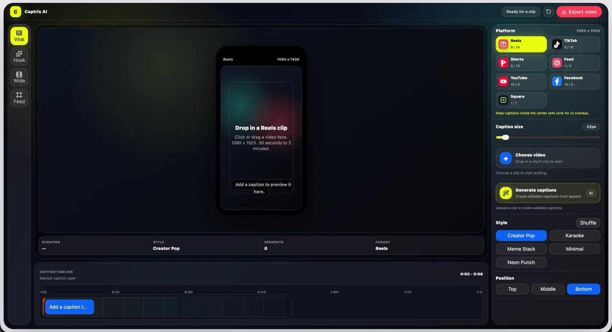

# Captrix AI

**Turn short clips into platform-ready videos with editable AI captions.**

[Live app](https://captrix-ai.vercel.app/) · [TestSprite workflow](https://github.com/ayush002jha/captrix/actions/workflows/testsprite.yml) · [Build loop](./LOOP.md)

Captrix AI is a browser-based caption studio for creators. Upload a 30-second to 2-minute clip, generate captions from speech, adjust timing on a visual timeline, apply creator-ready styles, preview platform formats, and export a video with captions burned in.




## What It Does

- Generates editable caption segments from video speech.
- Keeps silence gaps caption-free and supports draggable timing blocks and handles.
- Previews Reels, TikTok, Shorts, Feed, YouTube, Facebook, and square formats.
- Includes Creator Pop, Karaoke, Meme Stack, Minimal, and Neon Punch styles.
- Exports captioned WebM or MP4 video locally with quality, audio, filename, progress, and ETA controls.
- Runs as a focused, no-scroll browser studio with no account required.

## Built With

Next.js 16, React 19, TypeScript, Tailwind CSS 4, Hugging Face Transformers, Lucide icons, Vercel, and TestSprite CLI.

Primary coding agent: **OpenAI Codex**.

## TestSprite Loop

TestSprite project: `c91f693d-84bd-4ea7-8178-35352c93e8dc`

The CLI is wired into GitHub Actions and tests the deployed Vercel app. Coverage includes the landing-to-studio transition, editor controls, platform switching, caption styling, caption-generation guard, export guard, and timeline controls. The complete maker/checker/fix history is recorded in [LOOP.md](./LOOP.md), with plans in [`testsprite/plans`](./testsprite/plans).

Required repository secrets:

- `TESTSPRITE_API_KEY`
- `TESTSPRITE_PROJECT_ID`

## Run Locally

```bash
npm install
npm run dev
```

Open `http://localhost:3000`. No environment variable is required for the default experience. A custom speech endpoint can optionally be set with `NEXT_PUBLIC_CAPTRIX_TRANSCRIBE_ENDPOINT`.
